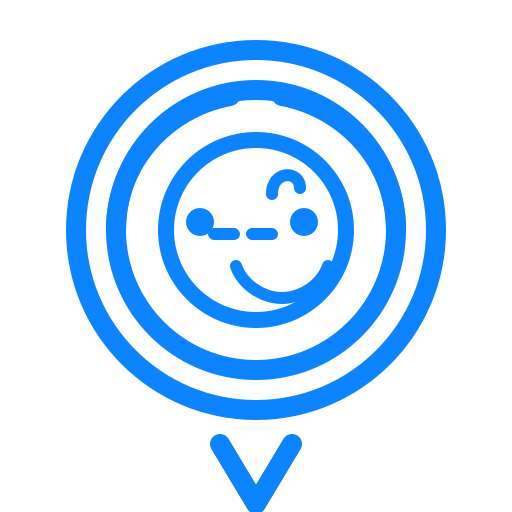

# SaveKid – propuesta de mockups con línea gráfica azul

A continuación se presentan mockups de referencia utilizando el logo proporcionado y una línea gráfica centrada en el azul "SaveKid" (#0D84FF). Los ejemplos muestran tanto vistas web como móviles para acompañar el flujo principal de localización y alertas de la plataforma.

## Identidad visual
- **Logo**: [`savekid-logo.svg`](../assets/savekid-logo.svg)
- **Color primario**: #0D84FF (acciones, iconografía y enlaces)
- **Secundario**: #0A5CCD (headers, sombras suaves)
- **Fondos claros**: #F4F8FF (paneles y tarjetas)
- **Estado**: éxito #2ED47A, alerta #FFB547, crítico #FF5C5C
- **Tipografía sugerida**: Inter / Work Sans, peso medio y semibold para títulos.

## Componentes base
- **App bar** en azul primario con el isotipo a la izquierda y botones de acción con esquinas redondeadas.
- **Tarjetas elevadas** con borde fino (#E4ECF7) y relleno claro para separar información de ubicación, batería y última actualización.
- **Botones**: primario sólido azul, secundario contorneado en azul, estados de hover con oscurecimiento leve.
- **Etiquetas de estado**: chips con fondo translúcido (por ejemplo, azul 12% de opacidad) y texto en el color de estado.

## Mockup 1 – Inicio web (escritorio)

  

    
    

      
SaveKid

      
Panel de inicio · Ubicaciones recientes

    

    

      <button style="background:#0d84ff; color:white; border:none; padding:10px 16px; border-radius:10px; font-weight:600;">Agregar dispositivo</button>
      <button style="border:1px solid #0d84ff; color:#0d84ff; background:transparent; padding:10px 16px; border-radius:10px; font-weight:600;">Compartir ubicación</button>
    

  

  

    

      

        
Mapa en vivo

        EN LÍNEA
      

      
Mapa con puntos activos

    

    

      

        
Dispositivo principal

        

          Última actualizaciónHace 2 min
        

        

          Batería82%
        

        

          <button style="background:#0d84ff; color:white; border:none; padding:8px 12px; border-radius:10px; font-weight:600;">Ver ruta</button>
          <button style="border:1px solid #e4ecf7; color:#0d84ff; background:#f4f8ff; padding:8px 12px; border-radius:10px; font-weight:600;">Alertas</button>
        

      

      

        
Zona segura activada

        
Notifica cuando se salga del perímetro definido.

      

    

  

## Mockup 2 – Vista móvil de seguimiento

  

    

      
      
SaveKid

      EN LÍNEA
    

    

      
Mapa

      
Pin activo

      

        Última señalHace 2 min
      

      

        <button style="flex:1; background:#0d84ff; color:white; border:none; padding:8px; border-radius:10px; font-weight:700;">Ruta</button>
        <button style="flex:1; border:1px solid #0d84ff; color:#0d84ff; background:transparent; padding:8px; border-radius:10px; font-weight:700;">Zona segura</button>
      

    

  

  

    

      
Alertas recientes

      

        Salida de zona segura
        Hace 5 min
      

      

        Batería baja
        15%
      

      <button style="width:100%; background:#0d84ff; color:white; border:none; padding:9px; border-radius:10px; font-weight:700;">Ver historial</button>
    

  

## Mockup 3 – Timeline de alertas (web)

  

    
    
Alertas y seguridad

  

  

    

      
Resumen de eventos

      

        

          
Salida de zona segura08:42

          
Parque Central · Radio 300 m

        

        

          
Velocidad elevada08:30

          
45 km/h cerca de casa

        

        

          
Batería baja08:05

          
15% restante · Recordar cargar

        

      

    

    

      
Acciones rápidas

      <button style="width:100%; background:#0d84ff; color:white; border:none; padding:10px; border-radius:10px; font-weight:700; margin-bottom:8px;">Activar zona segura</button>
      <button style="width:100%; border:1px solid #0d84ff; color:#0d84ff; background:transparent; padding:10px; border-radius:10px; font-weight:700;">Compartir en vivo</button>
      
Consejo: conserva coherencia usando el azul SaveKid para acciones principales y tarjetas con fondos muy claros para jerarquía.

    

  

---
Los mockups priorizan la visibilidad del logo, jerarquía clara en botones y tarjetas, y un uso consistente del azul SaveKid para acciones principales y señales de estado.
